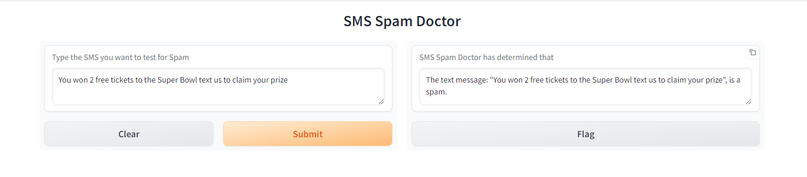

# SMS Spam Doctor

Web based UI to predict if a SMS

### The app covers following topics

1. [Importing required libraries](#libraries-required)
2. [SMS_Classification function](#sms-classification-function)
3. [Loading dataset in dataFrame](#loading-dataset-in-dataframe)
4. [Calling SMS Classification](#calling-the-sms_classification)
5. [SMS Prediction function](#sms-prediction-function)
6. [Gradio app](#gradio-app)


### Libraries required
```python 
import pandas as pd
# Import the required dependencies from sklearn
from sklearn.model_selection import train_test_split
from sklearn.pipeline import Pipeline
from sklearn.feature_extraction.text import TfidfVectorizer
from sklearn.svm import LinearSVC

# Set the column width to view the text message data.
pd.set_option('max_colwidth', 200)

# Import Gradio
import gradio as gr - # library for creating web based ui
```
### The app covers following topics

SMS_Classification function
Loading dataset in dataFrame
SMS Prediction function
Gradio app

### SMS Classification function
The function passes dataframe, creates X and y variables. X and y dataset are split using train_test_split function. The dataset is split as 33% data for test and balance for training.

A pipeline is built with TF-IDF vectorization and Linear Support Vector Classification. The function fits the model to the training data. The fitted pipeline is returned to make future predictions.

Here is the code of the function
```python
def sms_classification(sms_text_df):
    # Set the features variable to the text message column.
    y = sms_text_df['label']
    # Set the target variable to the "label" column.
    X = sms_text_df['text_message']

    # Split data into training and testing and set the test_size = 33%
    X_train, X_test, y_train, y_test = train_test_split(X,y, random_state=1, test_size=0.33)

    # Build a pipeline to transform the test set to compare to the training set.
    text_pipeline = Pipeline([('tfidf', TfidfVectorizer(stop_words="english")),
                              ('clf',LinearSVC())])

    # Fit the model to the transformed training data and return model.
    #text_pipeline.fit(X_train, y_train)
    text_pipeline = text_pipeline.fit(X_train, y_train)
    return text_pipeline
```


### Loading dataset in dataFrame
The code below will import dataset in the dataframe.

```python
# Load the dataset into a DataFrame
sms_text_df = pd.read_csv('Resources/SMSSpamCollection.csv')
sms_text_df.head()
```

### Calling the sms_classification
The code below will store trained model in the variable

```python
# Call the sms_classification function with the DataFrame and set the result to the "text_clf" variable
text_pipeline = sms_classification(sms_text_df)
```

### SMS Prediction function

Based on the trained model, the code below will predict if the message is spam or not a spam once the message text is passed in the function.


```python
# Create a function called `sms_prediction` that takes in the SMS text and predicts the whether the text is "not spam" or "spam". 
# The function should return the SMS message, and say whether the text is "not spam" or "spam".
def sms_prediction(text):
    
    # Create a variable that will hold the prediction of a new text.
    prediction = text_pipeline.predict([text])
    # Using a conditional if the prediction is "ham" return the message:
    # f'The text message: "{text}", is not spam.' Else, return f'The text message: "{text}", is spam.'
    if prediction == 'ham':
        return f'The text message: "{text}", is not a spam.'
    else:
        return f'The text message: "{text}", is a spam.'
```

### Gradio app

The following text messages can be tested to check if the message is spam or not a spam. The message 1 and 2 are not predicted as a spam while message 3 and 4 are predicted as spam

```markdown
## Test the following text messages. 

---

1. You are a lucky winner of $5000!
2. You won 2 free tickets to the Super Bowl.
3. You won 2 free tickets to the Super Bowl text us to claim your prize.
4. Thanks for registering. Text 4343 to receive free updates on medicare.
```

```python
# Creating Gradio app
app = gr.Interface(fn=sms_prediction, 
                   title="SMS Spam Doctor",
                   inputs=gr.Textbox(lines = 2, label = "Type the SMS you want to test for Spam", ),
                   outputs=gr.Textbox(lines=2, label="SMS Spam Doctor has determined that", show_copy_button=True))

# Launch the app
app.launch(show_error=True)
```

The app can also be launched using link this url:  http://127.0.0.1:7865

Below is a snapshot of SMS Spam doctor app predicting message # 3 as spam
